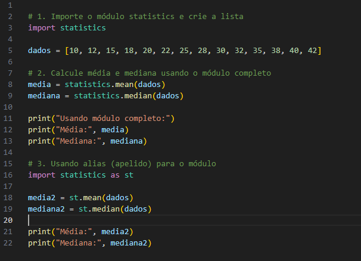
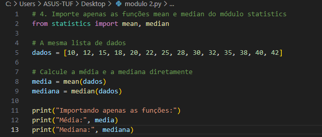
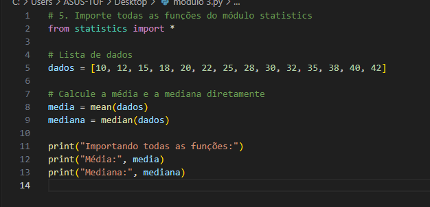

# 📊 Análise de Dados com o Módulo `statistics` em Python

Este projeto demonstra como utilizar o módulo `statistics` da biblioteca padrão do Python para calcular **média** e **mediana** de uma lista de números.

A lista usada contém 14 números inteiros em ordem crescente. O objetivo principal é mostrar diferentes formas de importar e usar funções do módulo `statistics`.

## ✅ Objetivos

* Calcular média e mediana de uma lista numérica.
* Explorar diferentes formas de importação do módulo `statistics`.

## 🧪 Métodos Utilizados

### 1. Importação Completa do Módulo

```python
import statistics
```

### 2. Uso de Alias (Apelido)

```python
import statistics as st
```

### 3. Importação Direta das Funções

```python
from statistics import mean, median
```

### 4. Importação de Todas as Funções

```python
from statistics import *
```

## 📈 Exemplo de Lista Utilizada

```python
dados = [10, 12, 15, 18, 20, 22, 25, 28, 30, 32, 35, 38, 40, 42]
```

## 📷 Capturas de Tela

### Passos 1, 2 e 3



### Passo 4



### Passo 5


